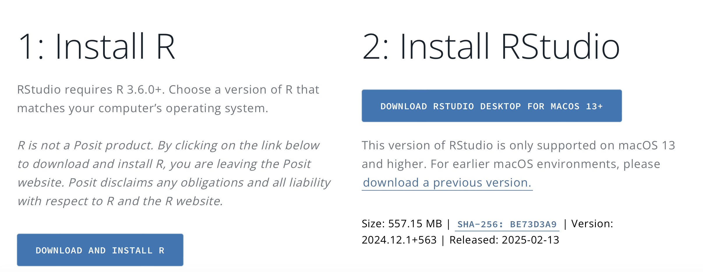

# Instalación de R y R Studio

Instalar R y R Studio de acuerdo a las siguientes indicaciones: <https://posit.co/download/rstudio-desktop/>



## 🧮 Aspectos básicos:

-   Entorno de R Studio:

-   Objetos: 

Son las estructuras de datos donde se almacenan valores en R. Pueden ser vectores, listas, matrices, factores, data frames, entre otros. Se crean asignando valores con <- o =.

Ejemplo:

``` {{r}}
x=100
z=200
y=x+z
y
```

```{r}
x=100
z=200
y=x+z
y
```


-   Funciones: Son bloques de código reutilizables que realizan tareas específicas. Pueden ser funciones predefinidas o personalizadas por el usuario.

Ejemplo:

``` {{r}}
suma <- function(a, b) {
  return(a + b)
}
suma(3, 5)  # Devuelve 8
```

```{r}
suma <- function(a, b) {
  return(a + b)
}
suma(3, 5)  # Devuelve 8
```


-   Paquetes: Son colecciones de funciones, datos y documentación que amplían las capacidades de R. Se instalan con install.packages("nombre_del_paquete") y se cargan con library(nombre_del_paquete).

``` {{r}}
install.packages("ggplot2")
library(ggplot2)
```


-   Bases de datos:  Son estructuras de datos tabulares similares a las hojas de cálculo, donde cada columna es un vector del mismo tamaño pero puede contener distintos tipos de datos. Se crean con data.frame().

``` {{r}}
datos <- data.frame(
  Nombre = c("Ana", "Luis", "Carlos"),
  Edad = c(25, 30, 28),
  Ciudad = c("Madrid", "Barcelona", "Valencia")
)

```

```{r}
datos <- data.frame(
  Nombre = c("Ana", "Luis", "Carlos"),
  Edad = c(25, 30, 28),
  Ciudad = c("Madrid", "Barcelona", "Valencia")
)

```


## 📂 Materiales de consulta:

- 📜 [Descargar PDF](cursos/semana1_teoria.pdf)\
- 🎥 [Ver Video](https://youtu.be/ejemplo1)
