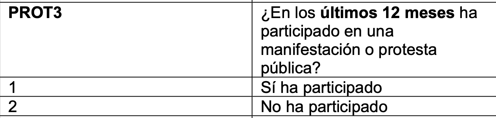
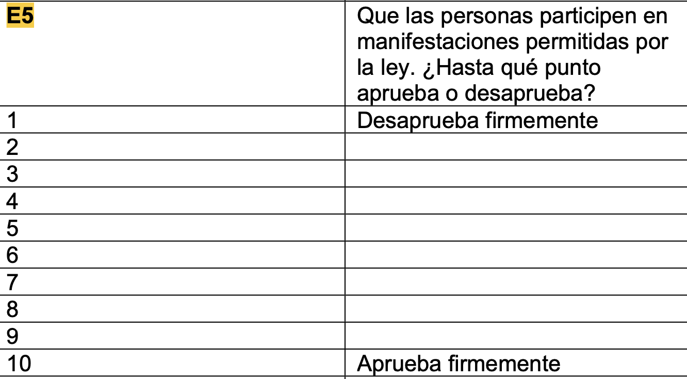
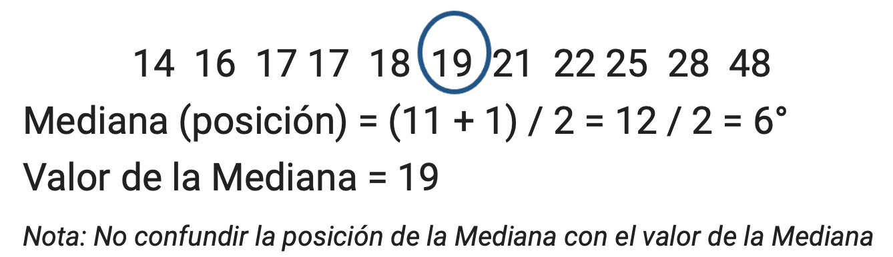
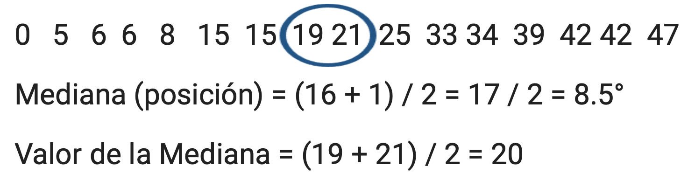
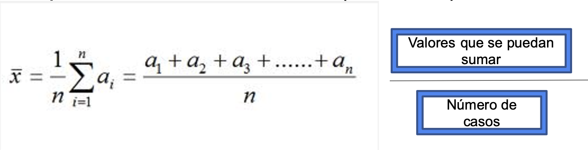
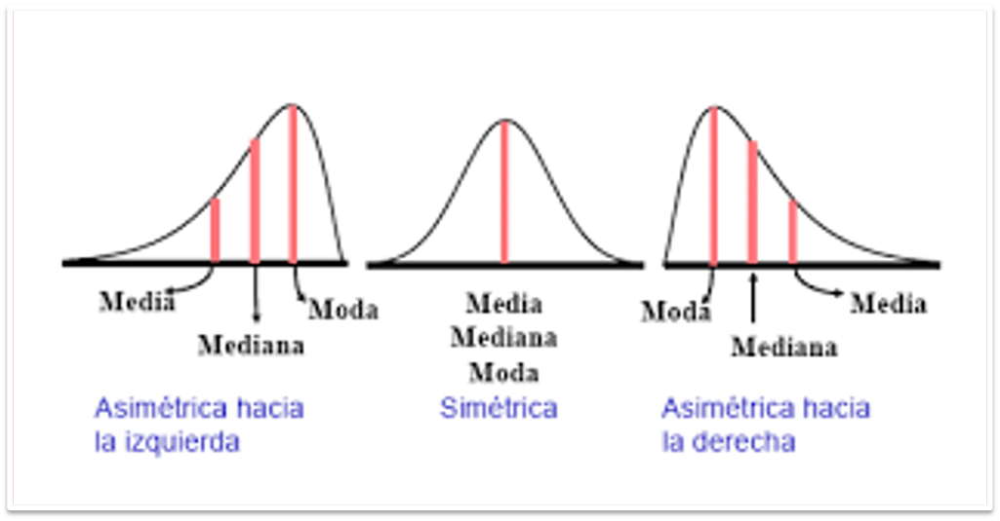

# Estadística Descriptiva

La estadística descriptiva es un conjunto de técnicas numéricas y gráficas para describir y analizar un grupo de datos. Utilizamos las medidas de tendencia central y de dispersión para informar sobre cómo se comportan los datos. Se pueden describir bases de datos extraídas a partir de una encuesta o en un registro.

**Preguntas claves para describir**

Si los individuos son los objetos descritos por un conjunto de datos. Los individuos pueden ser personas, pero también pueden ser animales o cosas.(Filas) Y una variable es cualquier característica de un individuo. Una variable puede tomar distintos valores para distintos individuos.(Columnas)

-   ¿Quién? ¿Qué individuos describen los datos? ¿Cuántos individuos aparecen en los datos?

-   ¿Qué? ¿Cuántas variables contienen los datos? ¿Cuáles son las definiciones exactas de dichas variables? ¿En qué unidades se ha registrado cada variable? El peso, por ejemplo, se puede expresar en kilogramos, en quintales o en toneladas.

-   ¿Por qué? ¿Qué propósito se persigue con estos datos? ¿Queremos responder alguna pregunta concreta? ¿Queremos obtener conclusiones so- bre unos individuos de los que no tenemos realmente datos?

**Medidas de tendencia central**

A las medidas de centralidad también se les conoce también como medidas de tendencia central

Las medidas de tendencia central (moda, mediana y media) muestran la medición más típica o representativa de una determinada distribución (Agresti y Finlay 1997)

Un estadístico de tendencia central proporciona una estimación de la puntuación típica, común o normal encontrada en una distribución de puntuaciones en bruto (Ritchey 2008)

Por lo general, la descripción de la distribución de una variables incluye una medida de su centro o tendencia central (Nota: Aunque pueda sonar extraño, esto también aplica para las variables categóricas nominales y ordinales)

Las medidas más comunes de esta tendencia central son:

-   Moda
-   Mediana
-   Media o Promedio

Utilizaremos la base de datos de LAPOP para extraer las medidas de tendencia central

<https://www.vanderbilt.edu/lapop/peru/ABPer2023-Peru-Questionnaire-V9.2.3.0-Spa-230309-W.pdf>

Emplearemos las siguientes dos preguntas :

{width="336"}

{width="432"}

# Preparando las variables a utilizar de la base de datos de LAPOP 2023

``` {{r}}
library(rio)
data=import("PER_2023_LAPOP.sav")
```

```{r}
library(rio)
data=import("PER_2023_LAPOP.sav")
```

-   Usamos el comando [**as.numeric**]{style="color:red"} para solicitar dar el formato de variable numérica.

``` {{r}}
data$manifestaciones_ley=as.numeric(data$e5)
data$manifestaciones_ley=as.numeric(data$manifestaciones_ley)
```

```{r}
data$manifestaciones_ley=as.numeric(data$e5)
data$manifestaciones_ley=as.numeric(data$manifestaciones_ley)
```

-   Usamos el comando [**as.factor**]{style="color:red"} para solicitar dar el formato de variable factor o categorica.

``` {{r}}
data$protesta=(data$prot3)
data$protesta=as.factor(data$protesta)
```

Si la variable es categórica, se requiere definir sus valores.

``` {{r}}
data$protesta=factor(data$protesta,levels = levels(data$protesta),
                labels = c("Sí ha participado","No ha participado"),
                ordered = F)
```

```{r}
data$protesta=(data$prot3)
data$protesta=as.factor(data$protesta)
data$protesta=factor(data$protesta,levels = levels(data$protesta),
                labels = c("Sí ha participado","No ha participado"),
                ordered = F)
```

# Moda

-   La Moda es el valor que ocurre con mayor frecuencia
-   Es particularmente útil con variables categóricas nominales y categóricas ordinales
-   A esta mayor frecuencia de un determinado valor corresponde el significado de centralidad en variables categóricas

*Moda en R Studio*

Usamos el comando [**table**]{style="color:red"} para solicitar una tabla de frencuencias e identificar el valor más alto.

``` {{r}}
table(data$protesta)
```

```{r}
table(data$protesta)
```

``` {{r}}
table(data$protesta) #No tiene sentido generar una tabla de variables numéricas.
```

```{r}
table(data$protesta)
```

## Moda en R Studio (2)

-   Otra forma con el paquete [**dplyr**]{style="color:green"}

``` {{r}}
install.packages("dplyr")
library(dplyr)
```

```{r}
library(dplyr)
```

-   Usamos el pipe **%\>%** para ordenar los comandos.

``` {{r}}
data %>%                      ## Paso 1: DATA 
  count(protesta=protesta, name = "Frecuencia") ## Paso 2: Pido una tabla de frecuencia de la variable continent
```

```{r}
data %>%                      ## Paso 1: DATA 
  count(protesta=protesta, name = "Frecuencia") ## Paso 2: Pido una tabla de frecuencia de la variable continent
```

## Moda en R Studio (3)

-   Otra forma con el paquete [**mutate**]{style="color:red"} para crear una nueva variable.

``` {{r}}
data %>%                     
count(protesta=protesta, name = "Frecuencia") %>%  mutate(Porcentaje=Frecuencia/sum(Frecuencia)*100)  
```

```{r}
data %>%                      ## Paso 1: DATA 
  count(protesta=protesta, name = "Frecuencia") %>%   ## Paso 2: Pido una tabla de frecuencia de la variable continent
  mutate(Porcentaje=Frecuencia/sum(Frecuencia)*100)  ## Paso 3: Creo una columna de %. Hasta aquí ya tienen una tabla simple. 
```

## Mediana

-   La Mediana es el punto medio de una distribución, es decir el valor que divide a la distribución en dos partes iguales.

-   Por lo tanto, debajo de ese valor se ubica el 50% de los casos y por encima de ese valor se ubica el otro 50% de los casos El cálculo de la Mediana es posible o tiene sentido cuando la variable que se está analizando es por lo menos ordinal.

## Cálculo de la Mediana

Para hallar la Mediana de una distribución se necesita:

1.  Ordenar todas las observaciones de la mínima a la máxima (lista ordenada)

2.  Si el número de observaciones es impar, entonces la mediana es la observación central de la lista ordenada.

3.  Para hallar la observación central (por lo tanto, el valor de la mediana), se usa la siguiente fórmula: (n + 1) / 2

4.  Si el número de observaciones es par, la mediana es el promedio (o la media) de las dos observaciones centrales de la lista ordenada.

## Cálculo de la Mediana cuando el número es impar

Tengo 11 números.

{fig-align="center" width="438"}

## Cálculo de la Mediana cuando el número es par

Tengo 20 números.

{fig-align="center" width="488"}

## Mediana en R Studio

Usamos el comando [**median**]{style="color:red"} para solicitar la mediana.

``` {{r}}
median(data$manifestaciones_ley,na.rm=T)
```

```{r}
median(data$manifestaciones_ley,na.rm=T)
```

Otra forma con el paquete [**dplyr**]{style="color:green"}

``` {{r}}
install.packages("dplyr")
library(dplyr)
```

```{r}
library(dplyr)
```

-   Usamos el comando [**summarize**]{style="color:red"} para resumir la información.

``` {{r}}
data %>%                      ## Paso 1: DATA 
  summarize(Mediana=median(manifestaciones_ley,na.rm=T))  ## Paso 2: Resumir 
```

```{r}
data %>%                      ## Paso 1: DATA 
  summarize(Mediana=median(manifestaciones_ley,na.rm=T))  ## Paso 2: Resumir 
```

## Media

La media o el promedio es la suma de todas las mediciones (valores) divididas por el número total de mediciones u observaciones

-   Fórmula para el cálculo de la Media (Promedio):

{width="406"}

## Media en R Studio

Usamos el comando [**media**]{style="color:red"} para solicitar la media

``` {{r}}
mean(data$manifestaciones_ley,na.rm=T)
```

```{r}
mean(data$manifestaciones_ley,na.rm=T)
```

Otra forma con el paquete [**dplyr**]{style="color:green"}

``` {{r}}
install.packages("dplyr")
library(dplyr)
```

```{r}
library(dplyr)
```

-   Usamos el comando [**summarize**]{style="color:red"} para resumir la información.

``` {{r}}
data %>%                      ## Paso 1: DATA 
  summarize(Promedio=mean(manifestaciones_ley,na.rm=T))  ## Paso 2: Resumir 
```

```{r}
data %>%                      ## Paso 1: DATA 
  summarize(Promedio=mean(manifestaciones_ley,na.rm=T))  ## Paso 2: Resumir 
```

## Media vs. mediana

-   La media es un estadístico sensible a los valores extremos.Basta que algún dato dentro de la muestra sea muy alto o muy bajo, el promedio se verá alterado.

-   La mediana, en cambio, es un estadístico robusto. Aunque los extremos de los datos se vean alterados, la mediana permanece invariable.

## Media vs. mediana en R studio

-   Usamos los paquetes [**dplyr**]{style="color:green"} y [**tidyverse**]{style="color:green"}

-   Usamos el pipe **%\>%** para ordenar los comandos.

``` {{r}}
install.packages("dplyr")
library(dplyr)
```

```{r}
library(dplyr)
```

-   Usamos el comando [**summarize**]{style="color:red"} para resumir la información.

``` {{r}}
data %>%                      ## Paso 1: DATA 
  summarize(Promedio=mean(manifestaciones_ley,na.rm=T),Mediana=median(manifestaciones_ley,na.rm=T))  ## Paso 2: Resumir 
```

```{r}
data %>%                      ## Paso 1: DATA 
  summarize(Promedio=mean(manifestaciones_ley,na.rm=T),Mediana=median(manifestaciones_ley,na.rm=T))  ## Paso 2: Resumir 
```

## Media vs. mediana en R studio en una tabla

-   Usamos el paquete [**kableExtra**]{style="color:green"}

-   Usamos los comandos [**kable**]{style="color:red"} y [**kable_styling**]{style="color:red"} para elaborar una tabla.

``` {{r}}
library(kableExtra)
```

``` {{r}}
data %>%                      ## Paso 1: DATA 
  summarize(Promedio=mean(manifestaciones_ley,na.rm=T),Mediana=median(manifestaciones_ley,na.rm=T)) %>%   ## Paso 2: Resumir 
  kable() %>%  # Paso 3: Convierte la tabla en código HTML
  kable_styling()# Paso 4: Se visualiza mejor la tabla.Esto te servirá cuando utilices Rmd dado que este crear un archivo HTML.
```

```{r}
library(kableExtra)
```

```{r}
data %>%                      ## Paso 1: DATA 
  summarize(Promedio=mean(manifestaciones_ley,na.rm=T),Mediana=median(manifestaciones_ley,na.rm=T)) %>%   ## Paso 2: Resumir 
  kable() %>%  # Paso 3: Convierte la tabla en código HTML
  kable_styling()# Paso 4: Se visualiza mejor la tabla.Esto te servirá cuando utilices Rmd dado que este crear un archivo HTML.
```

## Media vs. mediana en R studio por grupos

-   Usamos el comando [**group_by**]{style="color:red"} para referir los grupos en los que deseamos resumir la información.

``` {{r}}
data %>%                      ## Paso 1: DATA 
  group_by(protesta) %>%   
  summarize(Promedio=mean(manifestaciones_ley,na.rm=T),Mediana=median(manifestaciones_ley,na.rm=T))
```

```{r}
data %>%                      ## Paso 1: DATA 
  group_by(protesta) %>%   
  summarize(Promedio=mean(manifestaciones_ley,na.rm=T),Mediana=median(manifestaciones_ley,na.rm=T))
```

## Gráfico : Histograma

*Para variables numéricas*

1.  Instalar el paquete [**ggplot2**]{style="color:green"}

``` {{r}}
install.packages("ggplot2")
library(ggplot2)
```

```{r}
library(ggplot2)
```

2.  El comando [**aes**]{style="color:red"} denomina a las coordenadas 'x' y 'y'.

``` {{r}}
ggplot(data, aes(x=manifestaciones_ley))
```

3.  El comando [**geom_histogram**]{style="color:red"} genera el histograma.

``` {{r}}
ggplot(data, aes(x=manifestaciones_ley)) + geom_histogram()
```

```{r}
ggplot(data, aes(x=manifestaciones_ley)) + geom_histogram()
```

## Gráfico : Histograma por grupos

4.  El comando [**geom_histogram**]{style="color:red"} genera el histograma. Se emplea fill para colocar la variable factor.

``` {{r}}
ggplot(data, aes(x = manifestaciones_ley, fill = protesta)) +
  geom_histogram(alpha = 0.6, position = "dodge", bins = 20) +
  labs(title = "Histograma por Grupo", x = "Valor", y = "Frecuencia") +
  theme_minimal() +
  scale_fill_manual(values = c("blue", "red"))
```

```{r}
ggplot(data, aes(x = manifestaciones_ley, fill = protesta)) +
  geom_histogram(alpha = 0.6, position = "dodge", bins = 20) +
  labs(title = "Histograma por Grupo", x = "Valor", y = "Frecuencia") +
  theme_minimal() +
  scale_fill_manual(values = c("blue", "red"))
```

## Gráfico : Gráfico de Barras

*Para variables categóricas*

1.  Instalar el paquete [**ggplot2**]{style="color:green"}

``` {{r}}
install.packages("ggplot2")
library(ggplot2)
```

```{r}
library(ggplot2)
```

2.  El comando [**aes**]{style="color:red"} denomina a las coordenadas 'x' y 'y'.

``` {{r}}
ggplot(data, aes(x=protesta))
```

3.  El comando [**geom_bar**]{style="color:red"} genera el gráfico de barras.

``` {{r}}
ggplot(data = data, aes(x = protesta)) +
  geom_bar(fill = 'red')
```

```{r}
ggplot(data = data, aes(x = protesta)) +
  geom_bar(fill = 'red')

```

## Gráfico de barras con porcentaje

4.  El comando [**geom_bar**]{style="color:red"} genera el gráfico de barras.

``` {{r}}
tabla <- data%>%
  count(protesta)%>%
  mutate(Porcentaje=round(n/sum(n)*100,1))


# Crear gráfico de barras con ggplot2
ggplot(tabla, aes(x = protesta, y = Porcentaje, fill = protesta)) +
  geom_bar(stat = "identity") +
  labs(title = "Distribución por Porcentaje", x = "Grupo", y = "Porcentaje") +
  theme_minimal() +
  scale_fill_manual(values = c("blue", "red", "green")) +
  geom_text(aes(label = sprintf("%.1f%%", Porcentaje)), vjust = -0.5)
```

```{r}
tabla <- data%>%
  count(protesta)%>%
  mutate(Porcentaje=round(n/sum(n)*100,1))


# Crear gráfico de barras con ggplot2
ggplot(tabla, aes(x = protesta, y = Porcentaje, fill = protesta)) +
  geom_bar(stat = "identity") +
  labs(title = "Distribución por Porcentaje", x = "Grupo", y = "Porcentaje") +
  theme_minimal() +
  scale_fill_manual(values = c("blue", "red", "green")) +
  geom_text(aes(label = sprintf("%.1f%%", Porcentaje)), vjust = -0.5)
```

## Gráfico sin NA

5.  El comando !is.na significa no contar con datos perdidos.

``` {{r}}
tabla_sin_na <- subset(tabla, !is.na(protesta))

ggplot(tabla_sin_na, aes(x = protesta, y = Porcentaje, fill = protesta)) +
  geom_bar(stat = "identity") +
  labs(title = "Distribución por Porcentaje", x = "Grupo", y = "Porcentaje") +
  theme_minimal() +
  scale_fill_manual(values = c("blue", "red")) +
  geom_text(aes(label = sprintf("%.1f%%", Porcentaje)), vjust = -0.5)
```

```{r}
tabla_sin_na <- subset(tabla, !is.na(protesta))

ggplot(tabla_sin_na, aes(x = protesta, y = Porcentaje, fill = protesta)) +
  geom_bar(stat = "identity") +
  labs(title = "Distribución por Porcentaje", x = "Grupo", y = "Porcentaje") +
  theme_minimal() +
  scale_fill_manual(values = c("blue", "red")) +
  geom_text(aes(label = sprintf("%.1f%%", Porcentaje)), vjust = -0.5)
```

Más información en: <https://www.sharpsightlabs.com/blog/barplot-r-geom_bar/>

## Gráfico Circulas o Pie

``` {{r}}
ggplot(tabla_sin_na, aes(x = "", y = Porcentaje, fill = protesta)) +
  geom_bar(stat = "identity", width = 1) + 
  coord_polar(theta = "y") +  # Convierte a gráfico circular
  theme_void() +  # Elimina fondo y ejes
  labs(title = "Gráfico de Pastel en R") +
  scale_fill_manual(values = c("blue", "red")) 
```

```{r}
ggplot(tabla_sin_na, aes(x = "", y = Porcentaje, fill = protesta)) +
  geom_bar(stat = "identity", width = 1) + 
  coord_polar(theta = "y") +  # Convierte a gráfico circular
  theme_void() +  # Elimina fondo y ejes
  labs(title = "Gráfico de Pastel en R") +
  scale_fill_manual(values = c("blue", "red")) 
```

## Resumen de estadísticos de tendencia central


## Resumen de estadísticos de tendencia central

{fig-align="center"}

## Reto - Nivel 2

Debido a que ya se han convocado las Elecciones Generales 2026 en el Perú, es fundamental analizar la cultura política de los ciudadanos en relación con los comicios. Para ello, se utilizará la base de datos de la Encuesta LAPOP 2023, la cual proporciona información clave sobre las percepciones y actitudes sobre las elecciones. Realice con los resultados un informe descriptivo. Utilice los gráficos aprendidos.
