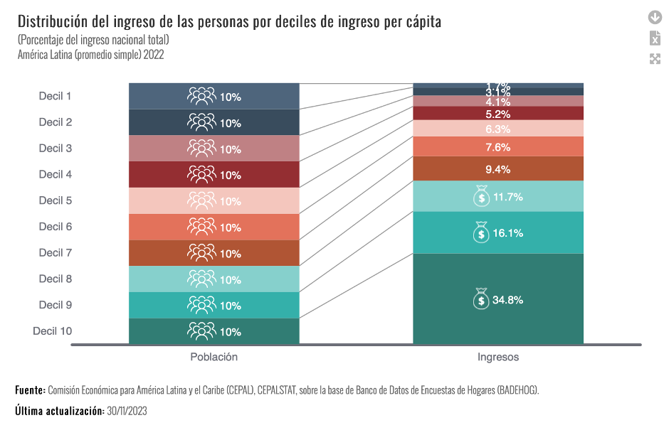

# Estadística Descriptiva

# Medidas de dispersión

Las medidas de variación describen la "extensión" de una data (Agresti y
Finlay 2009).

Las medidas de variabilidad o de dispersión muestran el grado en que un
conjunto de observaciones son homogéneas o heterogéneas entre si (Toma y
Rubio 2012).

Los estadísticos de dispersión describen cómo se dispersan las
puntuaciones de una variable de intervalo / razón (cuantitativa) a lo
largo de una distribución (Ritchey 2008)

Pregunta: ¿Existen medidas de dispersión para variables que no sean de
intervalo o razón?

Dos perspectivas:

La dispersión o variación es un atributo de variables intervalara.

Con algunas particularidades, es posible analizar la variación o
dispersión de variables nominales, ordinales e intervalares (diferentes
medidas de dispersión) (Moore 2005) Una manera de "resolver" estas
diferencias es considerar que existen (a) medidas de dispersión o
variación (para variables intervalares) y (b) medidas de posición (que
pueden ser usadas en variables ordinales para dar cuenta de su
dispersión)

Entonces en palabras simples,

Las medidas de dispersión son herramientas estadísticas que nos indican
qué tan dispersos o agrupados están los datos de un conjunto respecto a
un valor central (como la media).

En otras palabras, nos dicen cuánto varían los datos entre sí. Mientras
mayor sea la dispersión, más separados están los valores; mientras menor
sea, más homogéneos o parecidos son.

# La Desviación Típica

La Desviación Típica o Estándar mide la dispersión (la distancia) de
todas las observaciones respecto a la media o promedio Sin embargo, para
calcular la desviación típica o estándar (s) necesitamos calcular
primero la Varianza.

La fórmula de la desviación estándar es:

$$
\sigma = \sqrt{\frac{\sum (x - \mu)^2}{N}}
$$

Donde:\
- $\sigma$: desviación estándar\
- $x$: cada valor del conjunto de datos\
- $\mu$: la media del conjunto\
- $N$: cantidad total de datos

*Ejemplo:* Si una persona duerme 8 horas el lunes, 9 horas el martes, 10
horas el miercoles, 11 horas el jueves y 12 horas el viernes.

Entonces su promedio de horas de lunes a viernes es de 10 horas.

Cálculos (diferencia con la media):

(8 - 10)² = 4 (9 - 10)² = 1 (10 - 10)² = 0 (11 - 10)² = 1 (12 - 10)² = 4
Suma de cuadrados: 4 + 1 + 0 + 1 + 4 = 10 Varianza: 10 / 5 = 2
Desviación estándar: √2 ≈ 1.41

Los datos están muy cercanos al promedio → baja dispersión, es decir, el
número horas de sueño de esta persona es relativamente similar.

En cambio, si otra persona duerme 2 horas el lunes, 5 horas el martes,
10 horas el miercoles, 15 horas el jueves y 18 horas el viernes.

Su promedio de horas es de 10 horas.

Cálculos (diferencia con la media):

-   (2 - 10)² = 64
-   (5 - 10)² = 25
-   (10 - 10)² = 0
-   (15 - 10)² = 25
-   (18 - 10)² = 64

Suma de cuadrados: 64 + 25 + 0 + 25 + 64 = 178 Varianza: 178 / 5 = 35.6
Desviación estándar: √35.6 ≈ 5.96

Los datos están muy dispersos respecto al promedio → alta desviación.

Esta persona tendrá mucha diferencia en sus horas de sueño, lo cual
sugiere un transtorno de sueño.

# La Varianza

La Varianza (s2) de un conjunto de observaciones es la suma de los
cuadrados de las desviaciones de las observaciones respecto a su media
dividido por n -- 1

La fórmula de la varianza poblacional es:

$$
\sigma^2 = \frac{\sum (x - \mu)^2}{N}
$$

Donde:\
- $\sigma^2$: varianza\
- $x$: cada valor del conjunto de datos\
- $\mu$: la media del conjunto\
- $N$: número total de datos

Ejemplo:

```{r}
# Datos
valores <- c(4, 7, 10, 12, 17)

# Media
media <- mean(valores)

# Desviación

desviacion=sd(valores)
desviacion
# Varianza
varianza <- sum((valores - media)^2) / length(valores)
varianza

```

## Propiedades de la Desviación Típica o Estándar

-   La Desviación Típica o Estándar (s) mide la dispersión con relación
    a la media y tiene sentido usarla cuando se elige la Media como
    medida de tendencia central

-   La Desviación Típica o Estándar es igual a cero (s = 0) solo en los
    casos en los que no hay dispersión Esto ocurre únicamente cuando
    todas las observaciones toman el mismo valor. En caso contrario, la
    Desviación Típica o Estándar es mayor a cero (s \> 0).

-   A medida que las observaciones se separan más de la media, la
    Desviación Típica o Estándar (s) se hace más grande

-   La Desviación Típica o Estándar (s) tiene las mismas unidades de
    medida que las observaciones originales

-   Por ejemplo, si el ingreso familiar en Nuevos Soles, la Desviación
    Típica o Estándar (s) también se expresa en Nuevos Soles. Este es un
    motivo para preferir la Desviación Típica o Estándar a la Varianza,
    que se expresaría en Nuevos Soles al cuadrado

-   Igual que ocurre con la Media, la Desviación Típica o Estándar (s)
    no es robusta frente a valores atípicos o extremos.

-   Algunas pocas observaciones atípicas pueden hacer que sea
    particularmente grande

-   La Desviación Típica o Estándar es particularmente útil para las
    distribuciones normales (o que se aproximan a una distribución
    normal)

La base de datos que emplearemos es la de Estados Fallidos
(<https://fragilestatesindex.org/excel/>). El objetivo es describir el
índicador de estados fallidos de una muestra de 162 países.

1.  Indicar el directorio de trabajo. En el directorio de trabajo debe
    estar la base de datos en excel.

``` {{r}}
setwd("/Volumes/Macintosh HD - Datos/12 PUCP-Docencia/2025/Estadística 1/Estadistica1CienciaPolitica")
```

2.  Instalar el paquete [**rio**]{style="color:green"}

``` {{r}}
install.packages("rio")
library(rio)
```

## Abrimos la base de datos en R Studio

3.  Importamos la base de datos de excel. Usamos el comando
    [**import**]{style="color:red"}

``` {{r}}
data=import("EstadosFallidos2024.xlsx")
```

```{r}
library(rio)
data=import("EstadosFallidos2024.xlsx")
```

4.  Revisar las variables

``` {{r}}
str(data)
```

## Limpiar la base de datos en R Studio

5.  Averiguar si hay datos perdidos

``` {{r}}
if (sum(!complete.cases(data)) > 0) {
  print("Hay datos perdidos en el conjunto de datos.")
} else {
  print("No hay datos perdidos en el conjunto de datos.")
}
```

``` {{r}}
sum(is.na(data))
```

``` {{r}}
sum(is.na(data$Type))
```

``` {{r}}
sum(is.na(data$Total))
```

6.  Eliminar datos perdidos según una variable

``` {{r}}
data <- data[!is.na(data$Type),]
```

## Desviación Típica y Varianza en R.

Desviación Típica

-   Usamos el comando [**sd**]{style="color:red"} para solicitar la
    Desviación Típica.

``` {{r}}
sd(data$Total)
```

```{r}
sd(data$Total,na.rm=T)
```

``` {{r}}
sqrt(var(data$Total))
```

-   Usamos el comando [**sqrt**]{style="color:red"} para solicitar la
    raiz cuadrada.

```{r}
sqrt(var(data$Total))
```

Varianza

-   Usamos el comando [**var**]{style="color:red"} para solicitar la
    varianza

``` {{r}}
var(data$Total)
```

```{r}
var(data$Total)
```

## Medidas de Posición

-   Las Medidas de Posición son otra forma de describir la distribución
    de una variable

-   Las Medidas de Posición describen tanto la tendencia central como la
    variación de un conjunto de datos

-   La Mediana es un caso especial dentro de un conjunto de Medidas de
    Posición llamadas Percentiles

## Medidas de Posición: Rango

-   Indica cómo las puntuaciones de una variable ordinal o numérica se
    distribuyen de menor a mayor. Diferencia entre la puntuación máxima
    y mínima.

-   Usamos el comando [**max**]{style="color:red"} para solicitar el
    valor máximo.

``` {{r}}
max(data$Total)
```

```{r}
max(data$Total)
```

-   Usamos el comando [**min**]{style="color:red"} para solicitar el
    valor mínimo.

``` {{r}}
min(data$Total)
```

```{r}
min(data$Total)
```

-   Usamos el comando [**range**]{style="color:red"} para solicitar el
    rango

``` {{r}}
range(data$Total)
```

```{r}
range(data$Total)
```

## Medidas de Posición: Percentiles

-   El Percentil "x" es el punto (valor) que indica el "x" porcentaje de
    observaciones que están por debajo de él .

-   El Percentil 50 es el punto o valor a partir del cual un 50% de las
    observaciones se encuentran por debajo de él y un 50% de las
    observaciones se ubican por encima de él

-   Pregunta: ¿Qué nombre tiene el percentil 50?

## Medidas de Posición: Deciles, Cuartiles y Quintiles

Dependiendo del porcentaje de casos que se quiere identificar al
interior de una distribución se pueden usar:

-   Deciles (10%)

-   Cuartiles (25%)

-   Quintiles (20%)

El primer cuartil (C1 o Q1) separa el primer 25% de las observaciones

El segundo cuartil (C2 o Q2) es igual a la Mediana; es decir, divide las
observaciones en dos mitades

El tercer cuartil (C3 o Q3) separa el primer 75% de las observaciones

Por lo tanto, la distancia entre el C1 o Q1 y el C3 o Q3 contiene el 50%
de los datos centrales

Rango entre cuartiles

{width="460"}

<https://statistics.cepal.org/portal/inequalities/incomes.html?lang=es&indicator=4665>

{width="433"}

-   Usamos el comando [**quantile**]{style="color:red"} para solicitar
    el cuartiles

``` {{r}}
quantile(data$Total)
```

```{r}
quantile(data$Total)
```

## Medidas de Posición: Rango Intercuartil

Es la diferencia entre el tercer cuartil y el primer cuartil.

``` {{r}}
IQR(data$Total)
```

```{r}
IQR(data$Total)
```

## Valores Extremos

-   Son observaciones que se alejan del conjunto der datos. Una regla
    para determinar si un dato es outliers es:

-   Si un dato es \< Q1 -- 1.5(Q3-Q1)

-   Si un dato es \> Q3 + 1.5(Q3-Q1)

Los valores extremos por lo general son atribuibles a una de las
siguientes causas: La observación se registra incorrectamente.

La observación proviene de una población distinta. La observación es
correcta pero representa un suceso poco común (fortuito).

## Diagrama de cajas / Boxplot

-   Los diagramas de caja muestran la distribución de datos para una
    variable **numérica** y ordinal.

-   Los diagramas de caja ayudan a ver el centro y la extensión de los
    datos. También se pueden utilizar como herramienta visual para
    comprobar normalidad o identificar puntos que podrían ser valores
    atípicos.

-   Al utilizar un diagrama de caja, busque los valores extremos de sus
    datos. Tenga cuidado si el conjunto de datos es reducido. Si tiene
    variables nominales, utilice mejor un diagrama de barras.

Tanto los diagramas de caja como los histogramas muestran la forma de
los datos. Ambos pueden usarse para identificar valores atípicos o
inusuales. En este ejemplo el histograma es vertical en lugar de
horizontal.

Si los datos tienen grupos, quizá los comprenda mejor creando diagramas
de caja paralelos, lo que le aporta una manera sencilla y potente de
compararlos.

## Cálculo del Diagrama de cajas / Boxplot

1.  Calcular la mediana, el percentil 25 y el percentil 75.

2.  Calcular el rango intercuartílico (IQR) como la diferencia entre el
    percentil 75 y el 25.

3.  Calcular la longitud máxima de las patillas multiplicando el IQR por
    1,5. Identificar los valores atípicos.

4.  Usar las estadísticas calculadas para representar los resultados y
    trazar un diagrama de caja.

## Cálculo del Diagrama de cajas en R

``` {{r}}
library(ggplot2)
ggplot(data, aes(y = Total )) + 
  geom_boxplot()
```

```{r}
library(ggplot2)
ggplot(data, aes(y = Total )) + 
  geom_boxplot()
```

## Cálculo del Diagrama de cajas por grupos en R

``` {{r}}
library(ggplot2)
ggplot(data, aes(x=Continente,y = Total)) + 
  geom_boxplot()
```

```{r}
library(ggplot2)
ggplot(data, aes(x=Continente,y = Total)) + 
  geom_boxplot()
```

```{r}
library(dplyr)
data %>%                      ## Paso 1: DATA 
  group_by(Continente) %>%   
  summarize(Promedio=mean(Total),Mediana=median(Total),Cuartiles=quantile(Total, probs = c(0.25)))
```

## Cálculo del Diagrama de cajas por grupos en R

``` {{r}}
library(ggplot2)
ggplot(data, aes(x=Continente,y = Total,fill=Continente)) + 
  geom_boxplot()
```

```{r}
library(ggplot2)
ggplot(data, aes(x=Continente,y = Total, fill=Continente)) + 
  geom_boxplot()
```

## Valores Extremos o Outliers

Son observaciones que se alejan del conjunto der datos. Una regla para
determinar si un dato es outliers es:

Si un dato es \< Q1 -- 1.5(Q3-Q1)

Si un dato es \> Q3 + 1.5(Q3-Q1)

Los valores extremos por lo general son atribuibles a una de las
siguientes causas: La observación se registra incorrectamente.

La observación proviene de una población distinta. La observación es
correcta pero representa un suceso poco común (fortuito).

## Valores Extremos o Outliers

Los *outliers* en R también pueden aparecer debido a un error
experimental, de medición o de codificación.

Existen dos tipos de *outliers*:

-   Los valores extremos.

-   Los errores

-   <div>

    ## 

    </div>

``` {{r}}
outliers <- boxplot(data$outliers)$out
outliers
```

```{r}
outliers <- boxplot(data$Total)$out
outliers
```

# Histograma

Un histograma es un tipo de gráfico que se utiliza para representar la
distribución de frecuencias de un conjunto de datos numéricos.

Se compone de barras rectangulares que se agrupan en intervalos
(llamados clases o rangos). La altura de cada barra muestra cuántos
datos caen dentro de ese intervalo, es decir, su frecuencia.

# Histograma

A diferencia de un gráfico de barras convencional, en el histograma:

Los intervalos son continuos, por lo que las barras están juntas, sin
espacios entre ellas. El eje horizontal (X) representa los intervalos o
clases. El eje vertical (Y) muestra la frecuencia (cantidad de datos) en
cada intervalo.

## 

## Histograma en R

El comando [**geom_histogram**]{style="color:red"} genera el histograma.

``` {{r}}
ggplot(data, aes(x=Total)) + geom_histogram()
```

```{r}
ggplot(data, aes(x=Total)) + geom_histogram()
```

## Histograma con la curva de densidad en R

``` {{r}}
ggplot(data.frame(data), aes(x = Total)) +
       geom_histogram(aes(y = ..density..),
                      color = "gray", fill = "white") +
       geom_density(fill = "black", alpha = 0.2)
```

```{r}
ggplot(data.frame(data), aes(x = Total)) +
       geom_histogram(aes(y = ..density..),
                      color = "gray", fill = "white") +
       geom_density(fill = "black", alpha = 0.2)
```

## Histograma por grupos en R

``` {{r}}
ggplot(data, aes(x = Total, fill = Continente , colour = Continente)) + 
  geom_histogram(alpha = 0.5, position = "identity") + 
  theme(legend.position = "left") # Izquierda
```

```{r}
ggplot(data, aes(x = Total, fill = Continente , colour = Continente)) + 
  geom_histogram(alpha = 0.5, position = "identity") + 
  theme(legend.position = "left") # Izquierda

```

## Histograma por grupos en R

``` {{r}}
library(dplyr)
data %>%
  ggplot(aes(x = Total, group = Continente)) +
  geom_histogram() +
  facet_wrap(~ Continente) +
  labs(x = "Indice de Estados Fallidos", y = "Número de observaciones")
```

```{r}
library(dplyr)
data %>%
  ggplot(aes(x = Total, group = Continente)) +
  geom_histogram() +
  facet_wrap(~ Continente) +
  labs(x = "Indice de Libertad de Expresión", y = "Número de observaciones")
```

## Ejercicio

-   Realiza histogramas y boxplot de las demás variables de la base de
    datos de aprobación presidencial :
    <https://democracia-gobernabilidad.pucp.edu.pe/inicio>

-   Base de datos en PAIDEIA
    <https://paideia.pucp.edu.pe/cursos/mod/resource/view.php?id=2262785>

-   Calcula una tabla de los datos descriptivos de la aprobación
    presidencial por gobierno

-   Publica tu reporte html.
