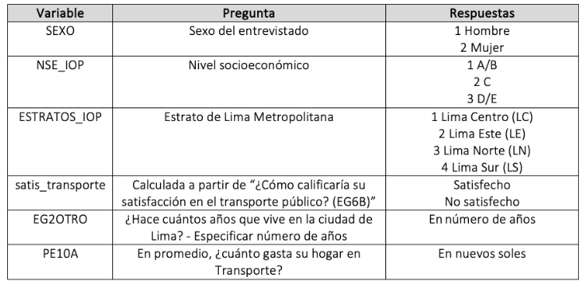

# Práctica Dirigida 4

<center></center>

**FACULTAD DE CIENCIAS SOCIALES - PUCP**<br>

## Curso: POL 278 - Estadística para el análisis político 1 \| Semestre 2025 - 1 <br>

------------------------------------------------------------------------

# **Dinámicas del uso de los medios de transporte en Lima**

El crecimiento acelerado de Lima ha generado una creciente preocupación sobre la calidad y eficiencia de los medios de transporte en la ciudad. La congestión vehicular, la falta de infraestructura adecuada y los largos tiempos de viaje afectan diariamente a millones de limeños. En este contexto, el análisis de datos cuantitativos se vuelve indispensable para entender el comportamiento de los usuarios, identificar áreas críticas y diseñar soluciones efectivas. En ese sentido en esta sesión responderemos a la siguiente pregunta:


## ¿Cuál es el estado del transporte en Lima según sus residentes? 🤔


Para acercarnos a responder la pregunta antes planteada se buscó información relacionada al uso del transporte público en Lima. Por lo tanto se eligió la encuesta de Lima Como Vamos, la cual es realizada a ciudadanos de Lima y Callao con la finalidad de conocer su percepción acerca de la movilidad, ambiente, seguridad ciudadana, espacios de recreación, cultura y satisfacción con la ciudad. Pueden encontrar más información acerca de esta base [aquí](https://www.limacomovamos.org/data/).

Para esta sesión se usará una versión *subseteada* de años anteriores que contiene las siguientes variables:

 


```{r}
library(rio)
data=import("pd4_Limacomovamos.xlsx") 
```

## ¿Cuál es el intervalo de confianza para la proporción de las personas que están satisfechas con el transporte público en Lima?


Para ello trabajaremos con la variable satis_transporte, que tiene dos valores posibles: Satisfecho y no satisfecho.

Para poder encontrar el intervalo de confianza para la proporción de ciudadanos de Lima y Callao satisfechos con el sistema de transporte, necesitamos tener muy claro la frecuencia de nuestro caso de éxito y del total de casos.

```{r}
table(data$satis_transporte)
```

```{r}
sum(table(data$satis_transporte))
```
Hallamos el invervalo de confianza para una proporción con el comando

```{r}
test_result <- prop.test(194, 3738, conf.level = 0.95)
test_result
```
Pasos para graficar: Intervalo de Confianza de una proporción

```{r}
# Extraer los resultados
proporcion <- test_result$estimate
lower_ci <- test_result$conf.int[1]
upper_ci <- test_result$conf.int[2]
```


```{r}
# Crear un data frame para ggplot
datita <- data.frame(
  Categoria = "Proporción",
  Proporción = proporcion,
  Lower_CI = lower_ci,
  Upper_CI = upper_ci
)
```

Gráfico del Intervalo de Confianza de una proporción

```{r}
# Graficar
library(ggplot2)
ggplot(datita, aes(x = Categoria, y = Proporción)) +
  geom_bar(stat = "identity", fill = "lightblue") +
  geom_errorbar(aes(ymin = Lower_CI, ymax = Upper_CI), width = 0.2, color = "darkblue") +
  labs(title = "Intervalo de Confianza para Proporción",
       y = "Proporción",
       x = "") +
  theme_minimal()
```

Esto quiere decir que tenemos un 95% de certeza de que, en la población, el porcentaje de ciudadanos de Lima y Callao satisfechos con el sistema de transporte oscila entre el 4.5% y 5.9% .


## ¿Cuánto gastan los residentes de Lima en transporte?

*Hallemos el intervalo de confianza para la media de la variable "PE10A".*

El enunciado de la pregunta es indicar "En promedio, ¿cuánto gasta su hogar en Transporte?".

```{r}
class(data$PE10A) #Revisemos que nuestra variable esté bien clasificada
```

**ciMean**, del paquete **lsr**, es la función que calcula el intervalo de confianza de una media.

```{r}
library(lsr)
ic_media = ciMean(data$PE10A, na.rm = TRUE) #con el último argumento indicamos no tomar en consideracion los valores perdidos (NA)

ic_media
```

```{r}
library(dplyr)
ic_grupo = data %>%
  summarise(Media = mean(PE10A, na.rm=T),
            LimiteInferior = ciMean(PE10A, na.rm=T)[1],
            LimiteSuperior = ciMean(PE10A, na.rm=T)[2])
ic_grupo
```


## ¿De qué manera la zona de Lima en la que vive la persona se relaciona con su gasto en transporte?

Hallemos el intervalo de confianza para el gasto en trasporte en promedio (PE10A) según estrato de lima (ESTRATOS_IOP).

Agreguemos etiquetas a la categórica


```{r}
data = data %>% 
  mutate(ESTRATOS_IOP=factor(ESTRATOS_IOP, levels = (1:4), labels = c("Lima Centro","Lima Este","Lima Norte", "Lima Sur")))
```

Crearemos una tabla con la media, máximo y mínimo de la variable PE10A, en base al grupo de ESTRATOS_IOP.

```{r}
library(dplyr)
ic_grupo = data %>%
  group_by(ESTRATOS_IOP)%>%summarise(Media = mean(PE10A, na.rm=T),
            LimiteInferior = ciMean(PE10A, na.rm=T)[1],
            LimiteSuperior = ciMean(PE10A, na.rm=T)[2])
ic_grupo
```

Según nuestra tabla, podemos afirmar que hay un 95% de probabilidad de que a nivel poblacional la media del grupo que los residentes de Lima Centro y Lima Norte gastan más en transporte que los de Lima Este.

Grafiquemos nuestros resultados.

```{r}
library(ggplot2)

ggplot(ic_grupo, aes(x = ESTRATOS_IOP, y = Media)) +
  geom_bar(stat = "identity", fill = "#00688B", color = "black") +
  geom_errorbar(aes(ymin = LimiteInferior, ymax = LimiteSuperior), width = 0.2) +
  
  # Etiquetas de la media
  geom_text(aes(label = paste(round(Media, 2))), vjust = -1, size = 4) +
  
  # Etiquetas de los valores mínimos
  geom_text(aes(y = LimiteInferior, label = paste("min:", round(LimiteInferior, 2))), 
            vjust = 1.5, hjust = -0.2, size = 3, color = "white") +
  
  # Etiquetas de los valores máximos
  geom_text(aes(y = LimiteSuperior, label = paste("max:", round(LimiteSuperior, 2))), 
            vjust = -0.5, hjust = -0.2, size = 3, color = "#00688B") +
  
  xlab("Zona de Lima") + 
  ylab("Promedio del gasto en transporte") +
  ylim(0, 140) +
  theme_minimal()
```

Con lo que muestra el gráfico, ¿cómo podemos complementar nuestra interpretación anterior?

- Lima Centro gasta significativamente más que Lima Este y Lima Sur, como lo indican los promedios y la falta de superposición considerable entre los IC.
- Lima Norte presenta un rango de gasto más amplio, lo que sugiere una variabilidad mayor en el gasto de transporte dentro de esa zona.
- Lima Este tiene un gasto más bajo y su intervalo de confianza no se superpone con el de Lima Centro, lo que podría indicar diferencias estadísticamente significativas entre estas dos zonas.

## ¿Existe una diferencia estadísticamente significativa entre el gasto en transporte entre hombres y mujeres?

Reviso mi df
```{r}
str(data)
```

```{r}
GSexo = data %>% 
  group_by(SEXO) %>%
  summarize(Media = mean(PE10A, na.rm = T))
GSexo
```

```{r}
GSexo[1,2] - GSexo[2,2]
```

La diferencia es de aprox 11 soles. ¿Puedo afirmar que existe esta diferencia en la población?

Para poder evaluar si existen o no diferencias poblacionales usaremos t.test

```{r}
t.test(PE10A ~ SEXO, data = data)
```

El valor p- value es 0.2642, que es mayor que el nivel típico de significancia (generalmente α = 0.05). Un valor p alto sugiere que *no* hay suficiente evidencia para rechazar la hipótesis nula. En otras palabras, no podemos concluir que existe una diferencia significativa entre las medias de los dos grupos (hombres y mujeres) con respecto a la variable PE10A.

# **Ejercicios para casa**

1.  Calcular el intervalo de confianza de la media para los años que llevan viviendo en Lima/Callao los residentes de Lima/Callao (EG2OTRO). Interprete
2.  Muestra un gráfico que los intervalos de confianza para la media de EG2OTRO según nivel socio económico (NSE_IOP). Interprete
3.  A partir de la variable EG2OTRO, se creó "Añoslima". Que tiene dos grupos "Más de 50 años" o "De 50 años a menos". Calcula el intervalo de confianza para la proporción de la variable "Añoslima" e interpreta.
