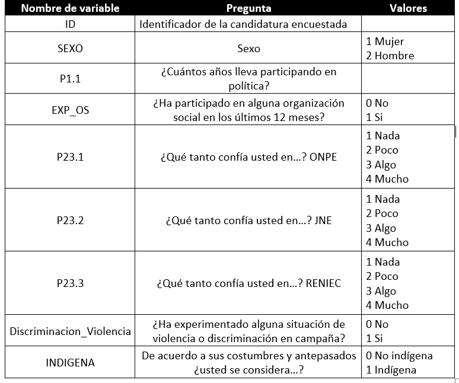

**FACULTAD DE CIENCIAS SOCIALES - PUCP**<br>

## Curso: POL 278 - Estadística para el análisis político 1 \| Semestre 2025 - 1 <br>

------------------------------------------------------------------------

# **Perfil de las candidaruras congresales EG 2021**

En el 2021, el Jurado Nacional de Elecciones aplicó la Encuesta Nacional a Candidaturas Congresales 2021, con el objetivo de elaborar un perfil de las candidaturas que postularon al Congreso de la República en el marco de las Elecciones Generales 2021.
Las temáticas que abordaron fueron las características sociodemográficas, trayectoria política, actitudes democráticas, motivaciones de las candidaturas, campaña electoral, discriminación y acoso político.
Puede acceder a la información mediante el libro [Radiografía de las candidaturas congresales](https://dnef.jne.gob.pe/publicaciones.html).
Además, la información se encuentra disponible en: [base de datos](https://dnef.jne.gob.pe/)

Para esta sesión se usará una versión que contiene las siguientes variables:



En ese sentido en esta sesión responderemos a la siguiente pregunta:

# **¿Cuál es el perfil en términos de la experiencia política y dificultades de las candidaturas en la campaña electoral del 2021?**

```{r warning=FALSE,message=FALSE}
library(rio)
library(dplyr)
library(lsr)
library(ggplot2)
```

```{r}
data = import("ENCC2021.xlsx")
names(data)
```

## **1. Análisis descriptivo**

### ¿Cuál es la proporción de candidaturas con experiencia de participación en organizaciones sociales?

```{r}
data = data %>% 
  mutate(Participacion_OS =factor(EXP_OS,labels=c("No","Si")))
```

```{r}
tabla1 = data %>% 
  group_by(Participacion_OS) %>% 
  summarise(Freq=n()) %>% 
  mutate(Porcentaje = (Freq/sum(Freq))*100)
tabla1
```

En la muestra, un 80.4% de candidaturas congresales que postuló en las EG 2021, contaba con experiencia en organizaciones sociales.

```{r}
ggplot(tabla1, aes(x=Participacion_OS,y=Porcentaje,fill=Participacion_OS))+
  geom_bar(stat="identity")+
  geom_text(aes(label=paste(round(Porcentaje,1),"%")),vjust=1.30, color="black", size=3)+
  ggtitle("Candidaturas con experiencia en organizaciones sociales (%)")+xlab("Ha participado en alguna organización social")+theme_classic()

```

### ¿Cuántos años llevan participando en política las candidaturas congresales de las EG 2021?

```{r}
data %>% 
  summarise(minimo=min(P1.1,na.rm = T),
            maximo=max(P1.1,na.rm = T),
            media=mean(P1.1,na.rm = T),
            mediana=median(P1.1,na.rm = T),
            sd=sd(P1.1,na.rm = T),
            Q1=quantile(P1.1,na.rm = T,0.25),
            Q3=quantile(P1.1,na.rm = T,0.75))
```

```{r,warning=FALSE,message=FALSE}
data %>%
  ggplot(aes(x = P1.1)) + 
  geom_histogram(color = "black", fill = "hotpink1", bins = 40) +
  ggtitle("Años participando en política de las candidaturas congresales - EG 2021 ") +
  ylab("Frecuencia")+xlab("Años participando en política")+
  geom_vline(xintercept =  mean(data$P1.1, na.rm = TRUE), color = "red", linetype = "dashed", size = 1) + # Línea de la media
  geom_vline(xintercept = median(data$P1.1, na.rm = TRUE), color = "grey", linetype = "dashed", size = 1) + # Línea de la mediana
  theme_minimal()

```

## **2. Intervalo de confianza para proporción**

Encontramos que la proporción de candidaturas con experiencia en organizaciones sociales es de 80.4%, calculemos cuanto será este valor en la población.

Previamente ya habíamos calculado la frecuencia de los que contaban con experiencia en organizaciones sociales y los que no, ingresemos esos datos en el prop.test

```{r}
tabla1
```

```{r}
prop.test(394,394+96,conf.level = 0.95)
```

La proporción de candidaturas con experiencia en organizaciones sociales se encuentra entre 76.55% y 83.77%, a un 95% de confianza.

## **3. Intervalo de confianza para media**

Anteriormente, encontramos que las candidaturas congresales tienen, en promedio, 12 años participando en política.
Calculemos cuanto es este valor en la población.

```{r}
ic_media = data %>%
  summarise(Media = mean(P1.1, na.rm=T),
            LimiteInferior = ciMean(P1.1, na.rm=T)[1],
            LimiteSuperior = ciMean(P1.1, na.rm=T)[2])
ic_media
```

A un 95% de confianza podemos concluir que, en promedio, una candidatura congresal de las EG 2021 tiene aproximadamente entre 11 y 13 años de experiencia participando en política.

## **4. Prueba T**

### ¿Existe diferencia entre la experiencia política (P1.1) de las mujeres y hombres que postularon en las EG 2021?

```{r}
data = data %>% mutate(SEXO = factor(SEXO, labels = c("Mujer","Hombre")))
```

```{r}
grafico = data %>% 
  group_by(SEXO) %>% 
  summarise(media = mean(P1.1,na.rm=T),
            Superior = ciMean(P1.1,na.rm=T)[1],
            Inferior = ciMean(P1.1,na.rm=T)[2])
grafico
```

En la muestra si existe una diferencia entre los años de experiencia en política de las candidaturas hombres y mujeres.
De esa manera, los hombres tienen más años (en promedio) participando en política que las mujeres.
Analicemos si esto se cumple en la población de candidaturas congresales de las EG 2021.

```{r}
t.test(P1.1~SEXO,data)
```

H0: No existe diferencia entre los promedios de los años de experiencia política entre hombres y mujeres.
/H1: Existe diferencia entre los promedios de los años de experiencia política entre hombres y mujeres.

Analizando el pvalor, podemos rechazar la hipótesis nula y así afirmar que las medias de los años de experiencia política entre hombres y mujeres, no son iguales.

Constatemos cual es la media más alta con un gráfico:

```{r}
ggplot(grafico,aes(x=SEXO,y=media))+
  geom_errorbar(aes(ymin=Inferior,ymax=Superior),width=0.4)+
  xlab("Sexo")+
  ylab("Años de experiencia en política")+theme_classic()
```

## **5. Prueba Chi Cuadrado**

¿De qué manera se relacionan las situaciones de discriminación en campaña y la autoidentificación étnica de las candidaturas?

```{r}
data = data %>% 
  mutate(Discriminacion_Violencia = factor(Discriminacion_Violencia,labels=c("No","Si")))
```

```{r}
data = data %>% 
  mutate(INDIGENA = factor(INDIGENA,labels=c("No indigena","Indigena")))
```

```{r}
table(data$Discriminacion_Violencia)
```

```{r}
tabla1=table(data$Discriminacion_Violencia,data$INDIGENA)
tabla1
```

Revisemos el supuesto

```{r}
chisq.test(tabla1)$expected
```

Si cumple con el mínimo por celda.

```{r}
tablapor1 = tabla1 %>%
           prop.table(1) %>%  
           round(2) #redondear el resultado a 2 decimales
tablapor1
```

```{r}
toPlot1 = as.data.frame(tablapor1) 
names(toPlot1) = c("Discriminacion_Violencia", "Indigena", "Porcentaje")
```

```{r}
  ggplot(toPlot1, aes(x=Discriminacion_Violencia, y=Porcentaje*100, fill=Indigena)) +
  geom_bar(position="stack", stat="identity")+ #Stack indica que son barras apiladas
  geom_text(aes(label=paste0(Porcentaje*100,"%")), 
            position = position_stack(vjust = 0.5), 
             size = 4,
             fontface="bold")+
  labs(x="Situaciones de violencia y discriminación en campaña", y="Porcentaje", fill="Autoidentificación étnica")+
  theme_minimal()
```

```{r}
chisq.test(tabla1)
```

H0: La autoidentificación étnica de las candidaturas es estadísticamente independiente de las situaciones de violencia o discriminación en campaña electoral

HA: La autoidentificación étnica de las candidaturas es estadísticamente dependiente de las situaciones de violencia o discriminación en campaña electoral

## **6. Indicador aditivo**

¿Cuál es la confianza de las candidaturas congresales en los organismos electorales durante las EG 2021?

```{r}
data=data %>%
  mutate(suma = P23.1 + P23.2 + P23.3)
```

```{r}
library(scales)
data = data %>%
  mutate(indicador = rescale(suma, to = c(0, 100)))
```

```{r}
data %>% 
  group_by(SEXO) %>% 
  summarise(
    Media = mean(indicador), 
    Mediana = median(indicador), 
    Desviacion = sd(indicador), 
    Minimo = min(indicador), 
    Maximo = max(indicador),
    Q1 = quantile(indicador, 0.25), #Primer cuartil
    Q3 = quantile(indicador, 0.75) #Tercer cuartil
  )
```
